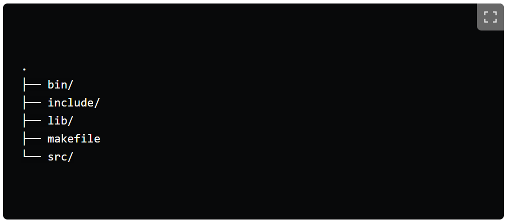

# How to write a good makefile for C++

Please refer this link, she has written this article [David Mendoza (He/Him)](https://dev.to/mendoza/how-to-write-a-good-makefile-for-c-32e3)

### Folder structure

> makefile
~~~
CXX       := g++
CXX_FLAGS := -Wall -Wextra -std=c++17 -ggdb

BIN     := bin
SRC     := src
INCLUDE := include
LIB     := lib
LIBRARIES   := 
EXECUTABLE  := main

all: $(BIN)/$(EXECUTABLE)

run: clean all
    clear
    @echo "🚀 Executing..."
    ./$(BIN)/$(EXECUTABLE)

$(BIN)/$(EXECUTABLE): $(SRC)/*.cpp
    @echo "🚧 Building..."
    $(CXX) $(CXX_FLAGS) -I$(INCLUDE) -L$(LIB) $^ -o $@ $(LIBRARIES)

clean:
    @echo "🧹 Clearing..."
    -rm $(BIN)/*
~~~